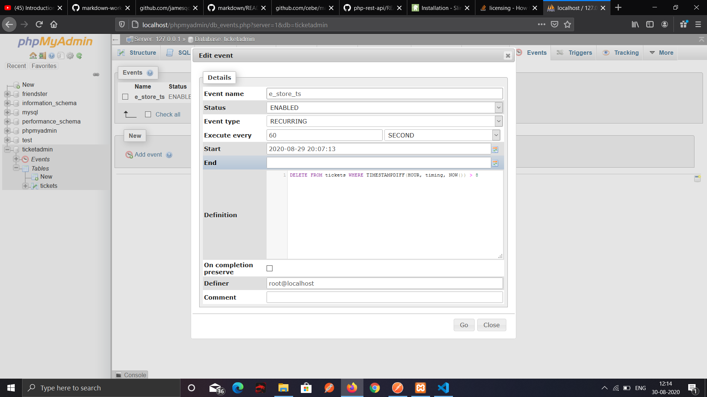
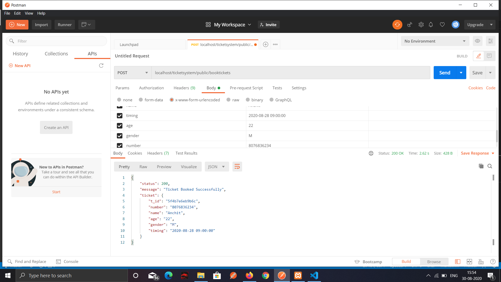
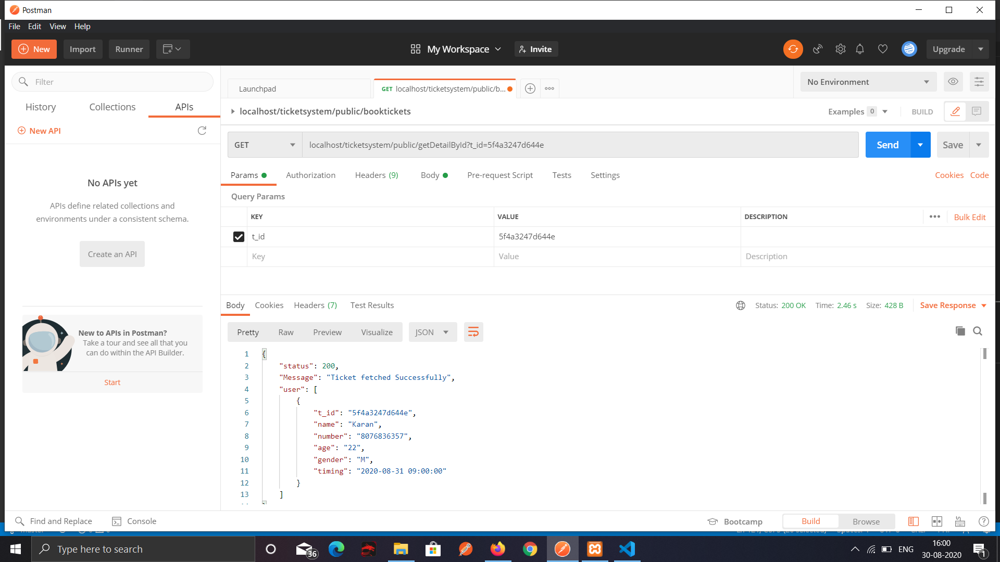
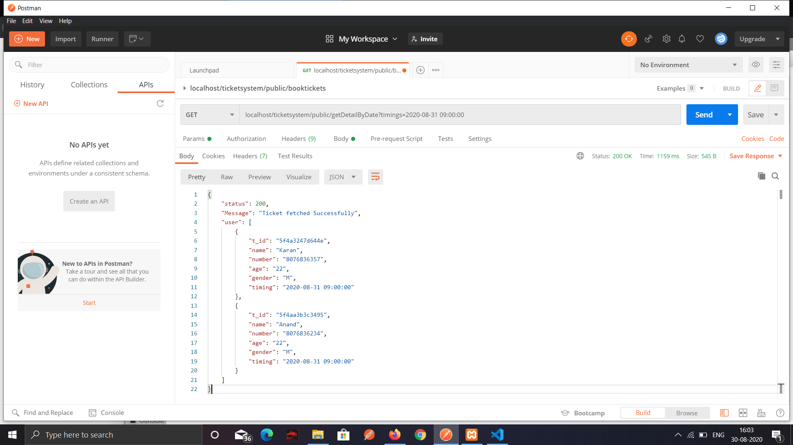
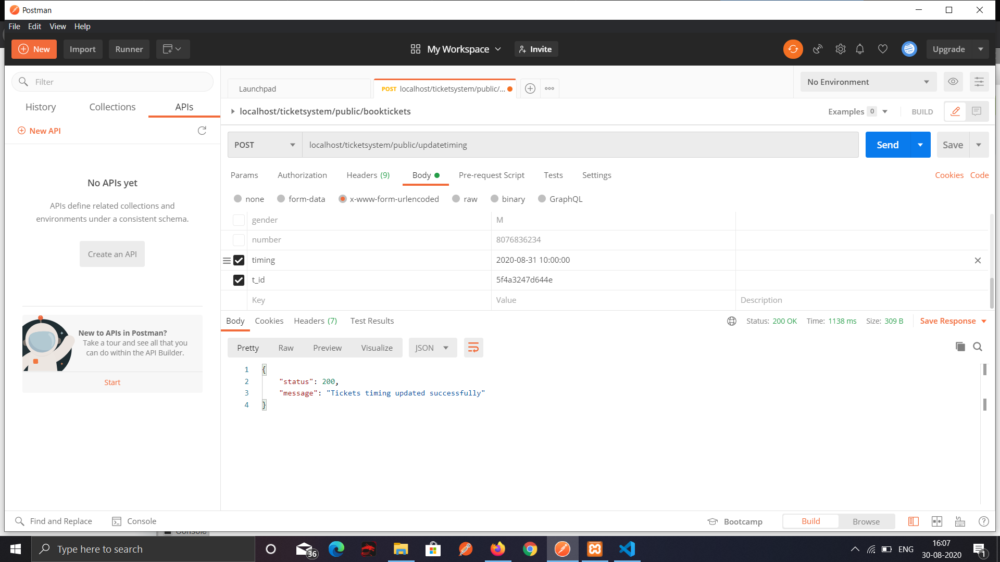
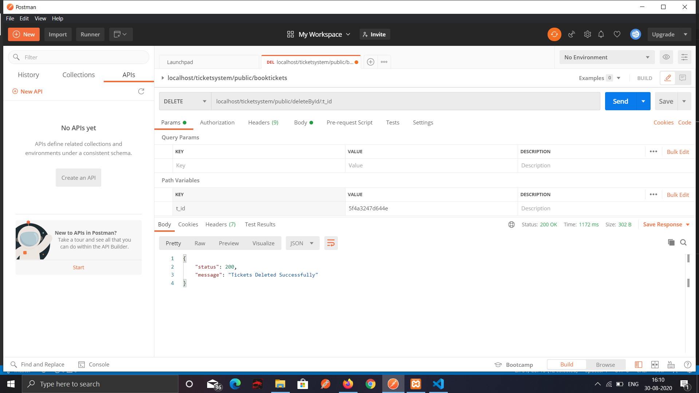
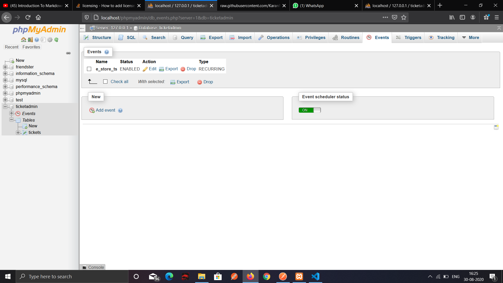

# TICKET BOOKING REST API

Ticket booking rest api is based on the idea how tickets get booked on real life. It is based on PHP's Slim microframework and My Sql. It Consist of endpoints to book a ticket, fetch user details on the basis of ticket id, fetch tickets on the basis of timings, delete a particular ticket, updating ticket time e.t.c. 
It consist of a magic feature of deleting tickets automatically which got expired. This is achieved through My Sql events.

## Sections

- [Installation](#Installation)
- [Endpoints](#Endpoints)
- [Automatic Expiration and Deletion of tickets](#Automatic-Expiration-and-Deletion-of-tickets)
- [Db Connection](#Db-connection)
- [Middlewares](#MiddleWares)
- [Functions Used](#Functions-Used)
- [Screenshots](#Screenshots)

## Installation 

- [PHP 5.4 or higher](http://www.php.net/downloads.php) is required to use it.
- [Slim framework 4.0 or higher](http://www.slimframework.com/docs/v4/start/installation.html) is required to use it.
- [Xampp for apache server and my sql](https://www.apachefriends.org/download.html) is required to use it.

Installation of slim is recommended to be done via [composer](https://getcomposer.org/download/) by running:

	composer require slim/slim:"4.*"

Installation of slim/PSR-7 also recommended to be done via [composer](https://getcomposer.org/download/) by running:

    composer require slim/psr7

## Endpoints

 ***Book Tickets***:

    $app->post('/booktickets', function($request, $response, $args) {
       
        //ticket count function to check number of tickets booked at particular time doesn't exceed 20.

        if(ticketCount($response, $requestData['timing']) > 20) {

        }

        //inserting the booked ticket in database

        $query = $pdo->prepare("INSERT INTO `tickets` (`name`, `age`, `gender`, `number`, `t_id`, `timing`) 
                           VALUES(:name, :age, :gender, :number, :t_id, :timing); ");

    }

***Get user details by ticket id***:

     $app->get('/getDetailById', function($request, $response, $args) {

         //query to fetch ticket based on id
         $query = $pdo->prepare("SELECT * FROM `tickets` WHERE `t_id`=:ticketId");

     }

***Get set of tickets on particular timing***:

    $app->get('/getDetailByDate', function($request, $response, $args) {
        
        //sql query to fetch set of tickets on particular timing
        $query = $pdo->prepare("SELECT * FROM `tickets` WHERE `timing`=:timings");
    }

***Update ticket timing***:

    $app->post('/updatetiming', function($request, $response, $args) {
        //sql query to update tickets timing
        $query = $pdo->prepare("UPDATE `tickets` SET `timing` = :timing WHERE `t_id` = :t_id");
    }

***Deleting a particular ticket***:

    $app->delete('/deleteById/[{t_id}]', function($request, $response, $args) {
        //query to delete a particular ticket.

        $ticketId = $args['t_id'];

        $query = $pdo->prepare("DELETE FROM `tickets` WHERE `t_id` = :t_id");
    }

## Automatic Expiration and Deletion of tickets

[Sql Events](https://www.mysqltutorial.org/mysql-triggers/working-mysql-scheduled-event/) are tasks that execute according to specified schedule. Therefore, sometimes MySQL events are referred to as scheduled events.  MySQL Events are named object which contains one or more SQL statement. They are stored in the database and executed at one or more intervals.

**References** :- https://stackoverflow.com/questions/6622301/can-i-set-a-mysql-event-schedule-using-phpmyadmin

#### ***Event Query***

    CREATE EVENT e_store_ts
    ON SCHEDULE
      EVERY 60 SECOND
    DO
      //timing is a column in table and HOUR is the unit.
      DELETE FROM tickets WHERE TIMESTAMPDIFF(HOUR, timing, NOW()) > 8 

#### ***Event Screenshot***

## Db connection

XAMPP SQL servers are used for db connection.

db is connected using following code:
     
     $dbh = "mysql:host=localhost; dbname=ticketadmin";
     $username = "root";
     $password = "";

     try {
         $pdo = new PDO($dbh, $username, $password);
     } catch (Exception $e) {
         echo json_encode(array('status' => 500, 'message' => 'Database Connection Error'));
         die();
 }

 ## Middlewares

 Two Middle wares classes are used:

 1. *BeforeMiddleWare.php*

        class BeforeMiddleware {
    
         public function __invoke($request, $handler): Response
         {
             if(!IS_APP_LIVE) {
                 sleep(1);
             }   
             $response = $handler->handle($request);
    
             return $response;
            }
        }

 2. *AfterMiddleware.php*

        class AfterMiddleware {
    
         public function __invoke($request, $handler): Response
           {
                $response = $handler->handle($request);
                $response->getBody()->write('AFTER');
                return $response;
            }
        }
       
## Functions Used

##### *Part of the functions are specified not whole function* 

1. *CheckError*
     
         function checkError($response, $errorData) {
            $output['status'] = $errorData[1];
            $output['message'] = IS_APP_LIVE ? "Query failed" : $errorData[2];

            $payload = json_encode($output);

            $response->getBody()->write($payload);

            //return status code 500 if query failed with message
 
            return $response->withHeader('Content-Type', 'application/json')->withStatus(500);

        }

2. *TicketCount*

       function ticketCount($response, $timings) {
    
          $query = $pdo->prepare("SELECT * FROM `tickets` WHERE `timing`=:timings")

          //return the no. of tickets booked on particular timing. 
          return $query->rowcount();

       }

3. *Validate Name*

       function validate_name($name) {

          //function to validate name 
          return preg_match('/^[a-z]*$/i', $name);
       }

4. *Validate Number*

        function validate_mobile($mobile) {
        
        //function to validate mobile number   
        return preg_match('/[0-9]{10}/s', $mobile);
    }

5. *Throw Error*

        function throw_Error($response, $message) {

            //function to throw client side error with response code 400
            return $response->withHeader('Content-Type', 'application/json')->withStatus(400);
        }

## Screenshots

### Postman Screenshot

 |  |||

### Db screenshots

 | 

## Authors

* **Karan Parwani** - *Initial work* - [Repo](https://github.com/KaranParwani1116?tab=repositories)

## Security

If you discover any security related issues, please email karanparwani.parwani102@gmail.com instead of using the issue tracker.    

## License

This project is licensed under the MIT License - see the [LICENSE.md](LICENSE.md) file for details